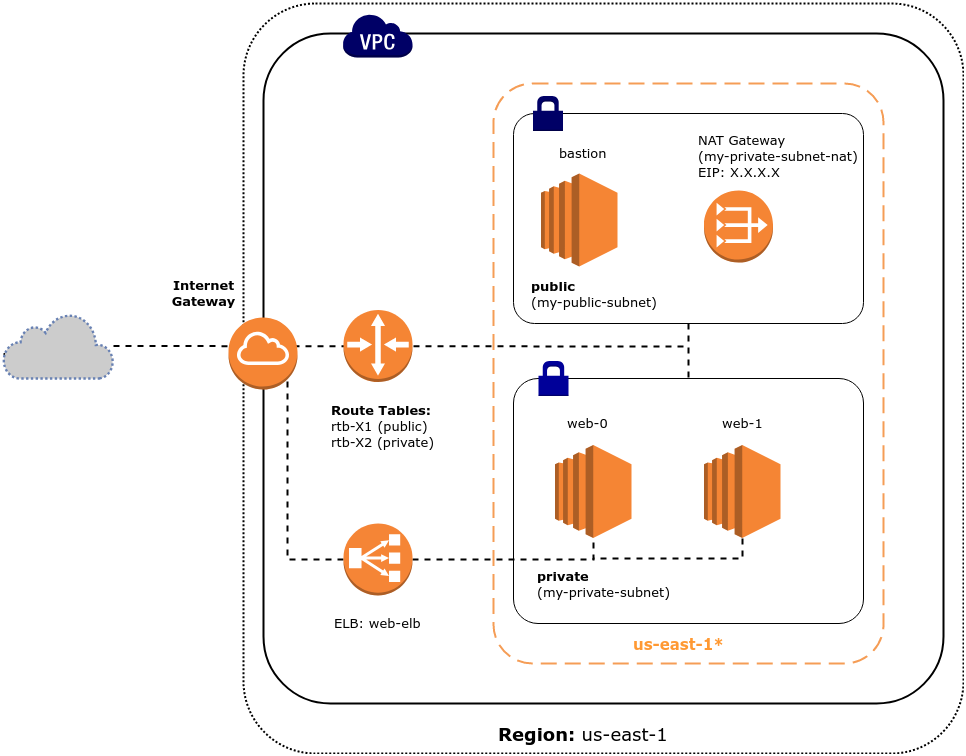

# Terraform templates example

`simple-web`

Is directory where described simple EC2 server in default VPC/subnets.

`subnets-web`

There described creating of new VPC with public and private subnets inside.

<p align="left">
  
</p>

If no additional procedures are exist inside of each dir you can apply them as follow:

```
$ terraform plan
$ terrafrom apply
```
